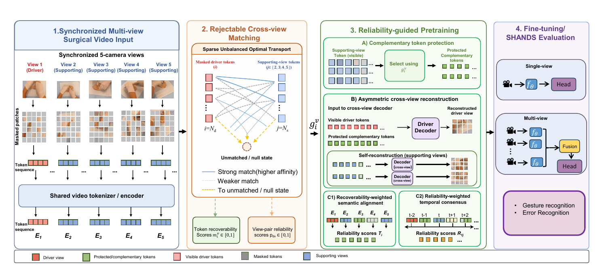

# SurgR-MAE: Selective Cross-View Learning for Recognizing Open-Surgical Gestures and Errors

Complete code will come soon!
## Abstract

In open-surgery training, video-based skill assessment requires recognizing execution gestures and
technical errors. This is challenging because decisive clinical cues, such as needle orientation, blade–tissue contact, and tissue deformation, are subtle, transient, and often
visible only from specific viewpoints. Thus, a single camera may be occluded precisely when evidence is needed. Synchronized multi-view video provides complementary
observations, but existing cross-view masked pretraining methods often implicitly treat synchronized views as valid
evidence for every masked region, forcing alignment even when the relevant cue is absent. We introduce SurgR-MAE,
a self-supervised multi-view masked autoencoder that estimates, for each masked driver-view token, whether the corresponding cue can be recovered from supporting views.
Recoverability is computed using sparse unbalanced optimal transport with an explicit unmatched state, allowing
the model to reject unreliable views rather than match visually similar but incorrect regions. The recoverability
score is smoothed into a reliability gate that drives complementary masking, reliability-weighted cross-view reconstruction, and semantic and temporal consistency, thereby
emphasizing cross-view supervision only where evidence appears reliable. All matching and gating modules are used
only during pretraining. At inference, SurgR-MAE retains a standard shared encoder with no transport, decoder,
or gate overhead and can operate with either single- or multi-view input. On the SHANDS benchmark, SurgR-MAE outperforms the strongest multi-view MAE baseline. 


## Method

<p align="center">
  
</p>
  SurgR-MAE is trained in four stages:
  
  1. **Synchronized multi-view input**  
     One camera is randomly selected as a heavily masked **driver view**, while the remaining cameras are moderately masked **supporting views**.
  
  2. **Rejectable cross-view matching**  
     Sparse unbalanced optimal transport matches masked driver tokens to candidate supporting-view tokens. An explicit null state allows the model to reject absent or unreliable evidence.
  
  3. **Reliability-guided pretraining**  
     The estimated recoverability gate controls:
     - complementary supporting-token protection;
     - asymmetric cross-view reconstruction;
     - recoverability-weighted semantic alignment;
     - reliability-weighted temporal consensus.
  
  4. **Downstream fine-tuning**  
     All pretraining-only modules are discarded. The shared video encoder is fine-tuned for:
     - surgical gesture recognition;
     - multi-label technical-error recognition.
  ### Inference design
  
  ```text
  Pretraining:
  Shared encoder + momentum encoder + OT matcher + reliability gate + decoders
  
  Inference:
  Shared encoder + task head
  ```
  
  The deployed model therefore has no optimal-transport, reconstruction-decoder, or reliability-gating overhead.
  

## Installation

```bash
pip install -r requirements.txt
```
## Dataset

SurgR-MAE is evaluated on **SHANDS**, a synchronized five-view RGB benchmark for open-surgical training. 
The dataset and access instructions will be linked here after release.

```text
data/
└── SHANDS/
    ├── videos/
    │   ├── C1/
    │   ├── C2/
    │   ├── C3/
    │   ├── C4/
    │   └── C5/
    ├── annotations/
    └── splits/
```
## Pretrained Models

| Model | Backbone | Pretraining data | Input views | Checkpoint |
|:--|:--:|:--:|:--:|:--:|
| SurgR-MAE-B | ViT-Base | SHANDS | 1–5 | Coming soon |

## Main Results
Experiments are conducted on the synchronized five-camera **SHANDS** benchmark.

# Citation

If you find this work useful, please cite:

```bibtex
@article{ma2026kdmvnet,
  title={SurgR-MAE: Selective Cross-View Learning for Recognizing Open-Surgical Gestures and Errors},
  author={Ma, Le and Freitas dos Santos, Thiago and Magnenat-Thalmann, Nadia and Philippe, Bijlenga and Wac, Katarzyna},
  year={2026}
}
```


